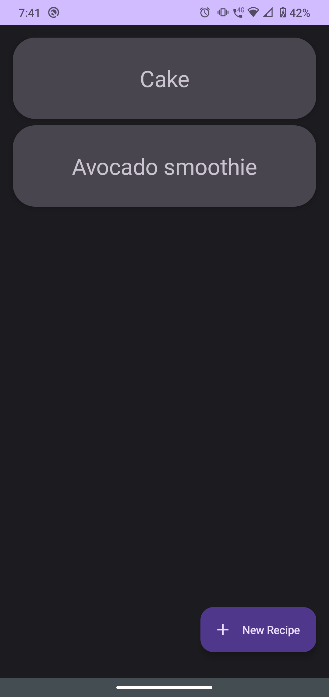
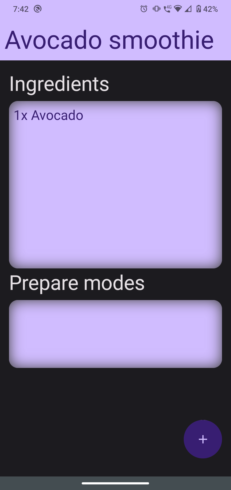
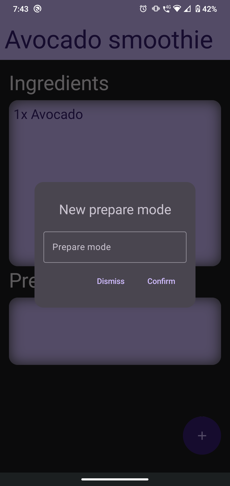

# Home Recipes - Android App

This is an Android App made with ***Compose***, for UI, and ***Room***, for data persistency.

## Table of contents

- [Overview](#overview)
  - [The app](#the-app)
  - [Screenshot](#screenshot)
- [My process](#my-process)
  - [Built with](#built-with)
	- [Useful resources](#useful-resources)

## Overview

### The app

Users should be able to:

- Insert new recipes, growing a list in the main screen
- Receive validation errors if:
  - The name input is *empty*
- Insert new ingredients and prepare modes, of each recipe
- Update either recipes, ingredients or prepare modes
- Delete either recipes, ingredients or prepare modes

### Screenshot

## My process

### Built with

- Kotlin
- Jetpack Compose
- Room
- Other Jetpack libraries
- MVVM architecture

### Useful resources

- [Composable Expandable FAB](https://github.com/suzdaleva/ComposeExpandableFAB)
